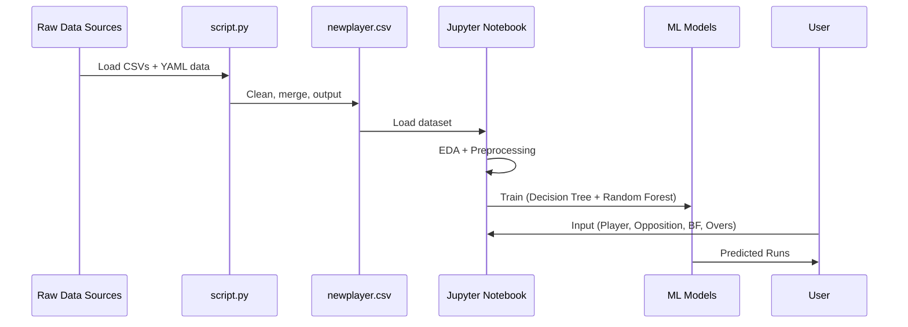

# System Architecture — Cricklytics

## System Overview

Cricklytics is a Python-based machine learning pipeline that processes historical cricket data from multiple sources, trains regression models, and predicts individual batting performance. It runs locally as a Jupyter Notebook with supporting data files and a preprocessing script.

## Architecture Diagram

```mermaid
graph TB
    subgraph "Data Sources"
        KG[Kaggle CSVs<br/>WC_players, Ground_Averages<br/>ODI_Match_Results, ODI_Match_Totals]
        CS[Cricsheets.org<br/>Ball-by-ball YAML data<br/>(odis/ folder)]
    end

    subgraph "Data Processing"
        SC[script.py<br/>Clean, Merge, Integrate]
        DS[newplayer.csv<br/>Unified Dataset]
    end

    subgraph "Analysis & Modeling (Jupyter Notebook)"
        EDA[Exploratory Data Analysis<br/>Correlations, Distributions, Trends]
        PP[Preprocessing<br/>Label Encoding, Feature Selection]
        DT[Decision Tree Regressor]
        RF[Random Forest Regressor]
        EV[Model Evaluation<br/>R² Score]
    end

    subgraph "Output"
        PR[Predicted Runs<br/>Per Player Per Match Scenario]
    end

    KG --> SC
    CS --> SC
    SC --> DS
    DS --> EDA
    EDA --> PP
    PP --> DT
    PP --> RF
    DT --> EV
    RF --> EV
    DT --> PR
    RF --> PR
```

## Component Descriptions

### Data Layer

| File | Purpose |
|---|---|
| `WC_players.csv` | World Cup player roster and basic stats |
| `Ground_Averages.csv` | Venue-specific batting/bowling averages |
| `ODI_Match_Results.csv` | Match outcomes (winner, margin, teams) |
| `ODI_Match_Totals.csv` | Match-level aggregate scores |
| `odis/` | Raw ball-by-ball YAML files from Cricsheets.org |
| `newplayer.csv` | Final merged dataset (output of script.py) |

### Processing Layer

**script.py** — Data integration pipeline:
1. Loads 6 CSV sources
2. Cleans whitespace, nulls
3. Identifies and normalizes player name columns
4. Merges batsman + bowler stats
5. Joins with WC players, ground averages, team averages, match totals
6. Fills missing values, outputs `newplayer.csv`

### Analysis & Modeling Layer

**Cricket Player Prediction.ipynb** — End-to-end ML workflow:
1. Load `newplayer.csv`
2. EDA: Visualize distributions, correlations, top performers
3. Preprocess: Encode categoricals, select features
4. Train/test split
5. Train Decision Tree Regressor
6. Train Random Forest Regressor
7. Evaluate with R² score
8. Interactive prediction (user inputs player, opposition, BF, overs)

## Data Flow



## Feature Pipeline

```
Raw Data → Clean → Merge → Label Encode → Feature Select → Train/Test Split → Model Training → Prediction
```

**Features used in prediction:**
| # | Feature | Type | Encoding |
|---|---|---|---|
| 1 | Player | Categorical | Label Encoded |
| 2 | Opposition | Categorical | Label Encoded |
| 3 | Balls Faced | Numeric | Raw |
| 4 | Overs | Numeric | Raw |

**Target variable:** Runs scored (continuous)

## Model Comparison

| Model | R² Score | Strengths | Weaknesses |
|---|---|---|---|
| Decision Tree | 0.993 | Interpretable, fast, handles non-linearity | Prone to overfitting |
| Random Forest | High | Robust, reduces variance, ensemble averaging | Less interpretable, slower |

## Project Structure

```
Cricklytics/
├── odis/                           # Raw YAML match data (Cricsheets.org)
├── Cricket Player Prediction.ipynb # Main ML notebook (EDA + Models)
├── script.py                       # Data integration/preprocessing script
├── newplayer.csv                   # Final unified dataset
├── WC_players.csv                  # World Cup player data
├── Ground_Averages.csv             # Venue statistics
├── ODI_Match_Results.csv           # Match outcome data
├── ODI_Match_Totals.csv            # Match aggregate scores
├── reverse_engineering/            # Architecture & docs (local)
└── .gitignore
```

## Execution Environment

- **Runtime**: Local Python environment or Jupyter Notebook
- **No server/deployment**: Runs entirely offline as a notebook
- **Data**: Static CSV files (no live API or database)
